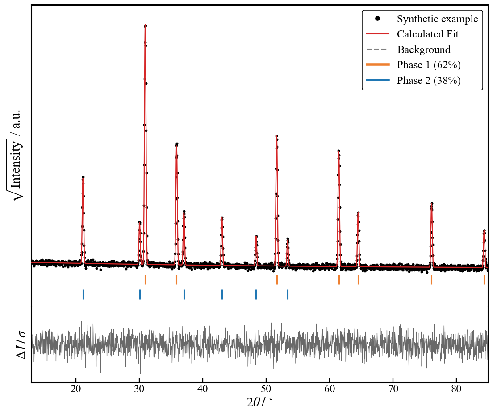

# XRD Rietveld Plot Generator

[](https://github.com/cristian-galeazzi/XRD-Plotter/actions/workflows/tests.yml)
[](LICENSE)
[](https://www.python.org/downloads/)

Give this notebook the CSV your Rietveld refinement exported. It returns the
figure you would put in a paper: measured pattern, refined fit and background
in the upper panel, reflection positions underneath, residuals below, written
out as a 600 dpi image and a vector PDF. You drop your files in a folder and
press run. One run processes the whole folder.



The figure above is drawn from an invented pattern, with two phases named
`Phase 1` and `Phase 2`, so it shows the layout and no measurement. Your own
phase names replace them, and the tick colours follow the order in the
legend.

## Quick start

You need no terminal. With Python and a notebook editor already set up, start
at step 3.

1. **Install Python** (3.10 or newer). On Windows, take the installer from
   [python.org](https://www.python.org/downloads/) and tick **Add python.exe
   to PATH** on the first screen. Everything else assumes it. macOS and Linux
   usually ship a suitable Python already.

2. **Install a notebook editor.** [VS Code](https://code.visualstudio.com/)
   is free and works the same on Windows, macOS and Linux. It offers to
   install its Python and Jupyter extensions the first time you open a
   notebook.

3. **Download this repository.** Use the green *Code* button above, then
   *Download ZIP*, then unzip it somewhere you find again.

4. **Open `XRD_Rietveld_Plotter.ipynb`** in VS Code, put your exported `.csv`
   files in the `data/` folder beside it, and press *Run All*.

5. *(Optional)* **Put `Samples_metadata.csv` beside the notebook**, not in
   `data/`, to print real sample names and phase fractions in the legends.
   See [Sample metadata](#sample-metadata-stays-out-of-the-repository) for
   the one required column.

You end up with this beside the notebook. You add files to `data/` only:

```
XRD_Rietveld_Plotter.ipynb
Samples_metadata.csv     <- optional, yours, never committed
data/                    <- your CSV exports go here
output/                  <- created on the first run, the figures land here
```

The first cell installs numpy, pandas, matplotlib and ipywidgets when they
are missing, so you install nothing by hand. Both folders are created when
absent, so a download or an unzip dropping the empty ones breaks nothing.
Each figure appears under the batch cell and is written to `output/` as a PDF
and a PNG.

From a terminal, `pip install -r requirements.txt` installs the four
libraries in one step, and the notebook then opens in any Jupyter host you
already have. Tested on Python 3.13 with numpy 2.4, pandas 3.0, matplotlib
3.10 and ipywidgets 8.1.

The notebook has four sections:

1. Setup and the plotting routines.
2. A self-check on synthetic data.
3. The batch run over `data/`.
4. A panel for trying a different window on one file.

The four batch settings sit in section 3 and default to `"data"`,
`"Samples_metadata.csv"`, `"output"` and `USE_SQRT = True`.

### Working in VS Code

*Select Kernel*, at the top right of the notebook, chooses which Python runs
it. A package looks missing right after you installed it? The notebook is
almost always running on a different Python from the one you installed into.
Pick the other kernel and run again.

### Working in Google Colab

> [!CAUTION]
> Colab means uploading your patterns to Google. Every file you drag into the
> Files sidebar leaves your machine and is processed on someone else's
> infrastructure. An embargo, a group policy or a collaboration agreement
> might forbid this, and a diffraction pattern of an unpublished sample is
> exactly the kind of file you do not own alone. Check before you upload. For
> your own unpublished measurements, run locally instead. It costs one
> `pip install` and your files never leave your machine.

Once that is settled, upload `XRD_Rietveld_Plotter.ipynb` through *File →
Upload notebook* and run all cells. The `data/` folder is created for you.
Drag your CSV files into it from the Files sidebar and re-run the batch cell.

## What you get

Two files per input file, both from the same drawing, in `output/`:

| File | Purpose |
|------|---------|
| `<name>_XRD_analysis_sqrt.pdf` | Vector, for the manuscript and for editing in Illustrator or Inkscape |
| `<name>_XRD_analysis_sqrt.png` | 600 dpi raster, for slides and for a quick look |

The suffix becomes `_linear` with `USE_SQRT = False`, and gains `_counts`
with `WEIGHTED_RESIDUALS = False`, so the variants never overwrite one
another.

The figure, from the top down: the observed pattern as black points, the
refined pattern as a red line, the refined background as a grey dashed line,
one row of coloured ticks per phase at its reflection positions, and a lower
panel with the residuals against a zero line. The legend names the sample and
the phase fractions.

The intensity axis carries no numbers. Counts in a diffractogram are
arbitrary units. An axis of tick labels invites the reader to compare values
across measurements where no comparison holds, and the space works harder for
the pattern.

**The 2θ axis shows everything you measured, unless you say otherwise.**
`PLOT_X_MIN` and `PLOT_X_MAX` start at `None`, so each figure spans its own
measured range. Give them numbers to hold every figure to one window, or put
`x_min` and `x_max` in the metadata row of a single sample. The metadata pair
wins over the constants.

**`WEIGHTED_RESIDUALS` picks the residual in the lower panel.** The default
`True` draws `diff/sigma`, the residual divided by the standard deviation of
the point, so a good refinement stays inside a band a few units wide whatever
the count rate. Set it to `False` to draw the raw `diff` in counts, where the
tall reflections dominate the panel. The axis label follows the setting.

**`USE_SQRT` changes what you see, never what is read.** Plotting √I instead
of I compresses the dynamic range, so weak reflections stay visible beside a
strong one. This is conventional in Rietveld figures. The transform touches
the drawn copy alone. Nothing is written back, and the residual panel stays
untouched.

## Which GSAS-II export to use

> [!IMPORTANT]
> GSAS-II has two CSV exports and one of them works here. Take the one behind
> the plot, not the one in the menu bar.

- **Use this.** On the refined powder pattern, open the publication-plot
  dialog and *Save* it with `csv` as the format. Internally this is
  `CopyRietveld2csv`. It writes one row per data point under a single header
  row. Files from it are read unmodified. You edit nothing.
- **Not this.** *Export → Powder data as → histogram CSV file* writes a block
  of quoted `"Histogram"`, `"Instparm: …"` and `"Samparm: …"` lines above the
  data, and names its columns `x, y_obs, weight, y_calc, y_bkg, Q`. The
  preamble alone makes it unreadable here. It also carries no residuals and
  no reflection positions, so editing recovers nothing.

The usable export contains, in this order: `used`, `x, 2theta (deg)`, `obs`,
`calc`, `bkg`, `diff`, then **one column per phase, labelled with the phase
name from your project**, then `tick-pos`, `diff/sigma` and `Axis-limits`.
The notebook reads what it needs and ignores the rest.

| Column | Header must | Required | Content |
|---|---|---|---|
| 2θ | contain `2theta` or `x,`, as `x, 2theta (deg)` does | Yes | Diffraction angle in degrees |
| Observed | be `obs` | No, though the figure is empty without it | Measured pattern |
| Calculated | be `calc` | No | Refined pattern |
| Background | be `bkg` | No | Refined background |
| Residuals | be `diff/sigma`, or `diff` with `WEIGHTED_RESIDUALS = False` | Yes | Drawn in the lower panel |
| Reflection positions, one column per phase | carry the phase name from your project | No | 2θ positions for that phase's tick row |

Matching ignores case and tolerates extra text, so `obs` and `Obs` name the
same column, and both `Phase 1` and `Phase 1 hkl` are recognised. Two
columns are required, the 2θ and the residuals. A missing `obs`, `calc` or
`bkg` is filled with zeros and reported on screen, so a partial file still
draws. The residual column is the exception. Zeros there draw a flat lower
panel, which reads as a perfect fit, so the file is skipped with `residual
column 'diff/sigma' not found`.

**Phases are found by elimination, not from a list of names.** The notebook
knows the headers GSAS-II writes itself, `used`, `diff`, `tick-pos`,
`Axis-limits`, `excluded` and the pattern columns above, listed in
`NON_PHASE_COLUMNS`. Any other column counts as a phase when it fills at most
half the rows. A reflection list always does, a data column never does. Your
phase names need no configuration. Name them as you like in GSAS-II and they
arrive in the legend. Every run prints the phases it found, per file, so a
column read the wrong way shows up at once.

The phase columns are shorter than the pattern. They hold their few
reflection positions, the remaining cells stay blank, and each column is
trimmed on its own.

**Fit statistics are not drawn on the figure.** No CSV export carries the
goodness of fit or a weighted profile R factor. Reading one back from a
column you added by hand would attach a number to the figure with nothing in
this notebook to check it against. Put the numbers in the sample name
instead. The `formula` field is free text and reaches the legend verbatim, so
`Sample 3, wR = 4.2%` renders as written.

| Feature | Behaviour |
|---------|-----------|
| Field separator | `;` and `,` are both detected |
| Decimal mark | `.` and `,` are both accepted, so a locale export needs no editing |
| Text encoding | UTF-8, with Latin-1 fallback |
| Unreadable or malformed file | Reported with its reason and skipped, and the rest of the batch still runs |
| Rows with more fields than the header | Skipped and counted on screen, and the rest of the file keeps its precision |
| Non-numeric cells inside a valid column | Become NaN, counted, reported, and masked out of the plot |

Nothing in the parser is specific to GSAS-II. An export from another
refinement program is read as soon as its columns carry the headers above, in
any order.

## Find the window before you run the batch

Section 4 draws one file at a time. Pick it from the dropdown, type the 2θ
and intensity limits, tick or untick the sqrt intensity and the `diff/sigma`
panel, press **Apply**. An empty box lets that end of the axis fit the data.
Nothing is written to `output/`.

Under the figure the panel prints the metadata line for the window you landed
on:

```
filename;formula;x_min;x_max
sample_3.csv;Sample 3;15;80
```

Paste it into `Samples_metadata.csv` and section 3 draws that sample this way
on every run. The intensity limits stay in the panel, since they depend on
`USE_SQRT` and describe a look rather than a fact about the sample.

## Sample metadata stays out of the repository

Your file names are usually internal sample codes, and the figure needs a
real name and the phase fractions. Both come from an optional
`Samples_metadata.csv` placed **beside the notebook**, one row per data file,
matched on the exact file name:

| Column | Required | Content |
|--------|----------|---------|
| `filename` (or `file`) | Yes | Name of the data file this row describes |
| `formula` | No | Display name for the figure legend |
| `<phase>_pct`, one per phase | No | Fraction (%) appended to that phase's legend entry |
| `<phase>_color`, one per phase | No | Tick and legend colour for that phase, as `#RRGGBB` or a matplotlib colour name |
| `x_min`, `x_max` | No | 2θ window for this sample alone, in degrees |

Name a fraction or colour column after its phase. `phase_1_pct` feeds the
`Phase 1` entry, `phase_1_color` paints it. The part before the suffix is
matched inside the legend name, with underscores read as spaces, so a
fragment of the name is enough. Decimal commas work here too.

Colours in the metadata keep the phase palette in your own private file
rather than in the notebook. Each run prints what it used, so you always
read the mapping back:

```
[sample_3.csv] phases detected: Phase 1 hkl, Phase 2 hkl
  colours: Phase 1 #1f77b4, Phase 2 #EE8031
```

A cell holding something matplotlib does not know as a colour is reported and
skipped, and that phase falls back to the cycle.

A fraction of zero, or a column you left out, prints the phase with no
percentage rather than `0%`. An empty `formula` cell falls back to the file
name. Two columns matching one phase print no percentage and say so, rather
than picking one. A column matching no phase in a file is reported for that
file.

Without the metadata file, or for a data file with no row in it, the legend
falls back to the file name and the phase entries carry no percentage.
Duplicate rows for one file are dropped after the first.

Keeping this file outside `data/` is deliberate. It is the one place where
sample identities live, so it stays a single file you control, and
[`.gitignore`](.gitignore) excludes it by name.

## Limitations

**An unknown sparse column is read as a phase.** Detection works by
elimination, so an extra column in your export, holding a handful of values
under a header the notebook does not know, gets its own tick row and legend
entry. Add its header to `NON_PHASE_COLUMNS` to ignore it again. This is why
every run prints the phases it detected.

**Tick colours follow the legend order unless you pin them.** With nothing
configured, the first phase in the legend takes the first colour of
`PHASE_COLOR_CYCLE`, so a sample missing one phase paints the remaining one
with the colour of the phase above it. Pin the colours to keep a series
comparable, either in the metadata with `<phase>_color`, which stays private,
or in `PHASE_COLORS` in the routines cell, which travels with the notebook.
`PHASE_LABELS` does the same for a legend name different from the column
header. Both dictionaries ship empty.

**A fixed 2θ window hides data without saying so.** `PLOT_X_MIN` and
`PLOT_X_MAX` default to `None` and draw the measured range of each file. Set
them, or set `x_min` and `x_max` for one sample, and everything outside is
parsed, masked and never shown, with no warning. Prefer the per-sample
columns when one pattern alone needs cropping.

**It draws what the export contains and cannot judge it.** The residual panel
is copied from the refinement, not recomputed. A refinement converged on the
wrong structure still produces a clean-looking figure. The plotting is
validated. The crystallography stays yours.

## How it works and how it was checked

Parsing is the one place where numbers take damage, so it avoids the single
lossy step available to it. Every numeric column is read as text and
converted with Python's built-in `float()` rather than pandas' fast C
converter, which is not correctly rounded and lands up to one unit in the
last place away from the nearest double. Both decimal marks go through the
same conversion, so an export with decimal commas parses to the same doubles
as the same export with decimal points. Everything downstream is IEEE-754
double precision with no intermediate rounding. Numbers are rounded only when
printed on the figure, and √I is applied to the drawn copy alone.

Section 2 builds synthetic exports at run time from an analytic pattern with
a fixed seed (`default_rng(0)`) and asserts:

| Case | Purpose |
|------|---------|
| Semicolon separator, decimal commas | Bit-exact parsing of a locale export, asserted with `array_equal`, at zero tolerance |
| Comma separator, decimal points, `x, deg` header | The same doubles from the other header and locale variant |
| Both variants | Both phase columns detected and trimmed independently |
| A file of arbitrary bytes | Isolated with a reason instead of raising |
| A CSV with no 2θ column | Isolated as `2theta column not found` |
| A CSV with only 2θ and `Obs` | Isolated as `residual column 'diff/sigma' not found` |
| A CSV with 2θ, `Obs` and `diff/sigma` | `calc` and `bkg` filled with zeros, reported, still plotted |
| A CSV with one over-long row | The row skipped and counted, every other row still bit-exact |
| A complete export, phases named `Alpha` and `Beta` | Only the two phases detected among eleven columns, `tick-pos` and `Axis-limits` left alone |
| A synthetic metadata row | Name and both phase fractions arrive in the legend text |
| A third phase | Legend in alphabetical order, one tick row each, the colour cycle handed out in that order |
| A `<phase>_color` cell, and one holding text that is not a colour | The colour follows its phase alone and beside another, the invalid cell is reported and falls back to the cycle |
| Metadata with a decimal comma, an empty `formula` and an unmatched `_pct` column | 60,5 read as 60.5, the file name used as the legend name, the unmatched column reported |
| Two metadata columns matching one phase | No percentage printed, and a warning naming both columns |
| The window unset, then the constants, then `x_min`/`x_max` in the metadata | The measured range, then the constants, then the per-sample pair, each overriding the one before |
| The same export with `WEIGHTED_RESIDUALS = False` | The raw `diff` read bit-exact, the panel relabelled, a file without `diff` isolated |
| The function behind the section 4 panel | Limits applied to both axes, the metadata line returned, the residual setting restored, an unreadable file raising |

The section raises `AssertionError` on the first failure, so executing the
notebook is a test run:

```bash
python -m nbconvert --to notebook --execute --output executed.ipynb XRD_Rietveld_Plotter.ipynb
```

CI runs this on every push, on the Python floor claimed above and on the
version this is developed with. Only synthetic data is used, so the check
runs anywhere, including on a fresh clone with an empty `data/`.

## Privacy: nothing private gets published

This repository holds no experimental or personal data, and none must ever be
committed or published. Three layers enforce this:

1. **Ignored paths.** `data/`, `output/` and `Samples_metadata.csv` are
   excluded in [`.gitignore`](.gitignore). The self-check uses synthetic
   patterns only.
2. **Stripped notebook outputs.** Executed cells embed their results,
   figures and sample names included, inside the `.ipynb` file. Strip them
   before every commit:

   ```bash
   jupyter nbconvert --clear-output --inplace XRD_Rietveld_Plotter.ipynb
   ```

3. **Automatic strip on commit (recommended).** Install
   [nbstripout](https://github.com/kynan/nbstripout) once per clone. Git then
   strips outputs at commit time, and a forgotten manual strip leaks nothing:

   ```bash
   pip install nbstripout
   nbstripout --install        # run inside the git repository
   ```

## How to cite

See [`CITATION.cff`](CITATION.cff). GitHub shows a "Cite this repository"
button. For a permanent, versioned DOI, archive a tagged release on
[Zenodo](https://zenodo.org).

For a refinement done in GSAS-II, whose export format this notebook targets,
please also cite:

> B. H. Toby, R. B. Von Dreele, "GSAS-II: the genesis of a modern
> open-source all purpose crystallography software package",
> *J. Appl. Cryst.* **46**, 544-549 (2013),
> doi:[10.1107/S0021889813003531](https://doi.org/10.1107/S0021889813003531)

Please also cite the libraries behind this notebook:

- J. D. Hunter, "Matplotlib: A 2D Graphics Environment",
  *Comput. Sci. Eng.* **9**, 90-95 (2007),
  doi:[10.1109/MCSE.2007.55](https://doi.org/10.1109/MCSE.2007.55)
- The pandas development team, *pandas-dev/pandas: Pandas*, Zenodo,
  doi:[10.5281/zenodo.3509134](https://doi.org/10.5281/zenodo.3509134)
- C. R. Harris *et al.*, "Array programming with NumPy", *Nature* **585**,
  357-362 (2020),
  doi:[10.1038/s41586-020-2649-2](https://doi.org/10.1038/s41586-020-2649-2)

## AI assistance

This software was developed with the assistance of Claude (Anthropic): the
initial version with Claude Fable, later revisions with Claude Opus. The
author supervised and reviewed every change and remains solely responsible
for the method, the self-check and any result published with this software.

## License

MIT, see [`LICENSE`](LICENSE).
