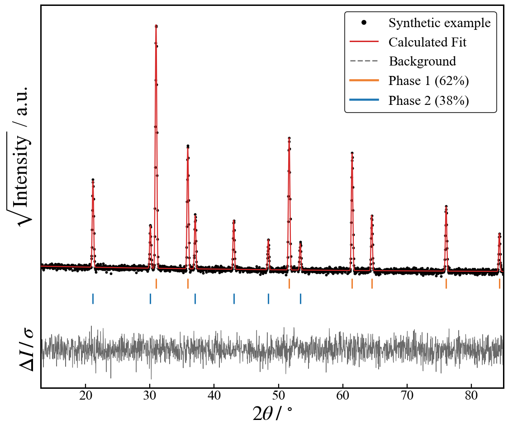
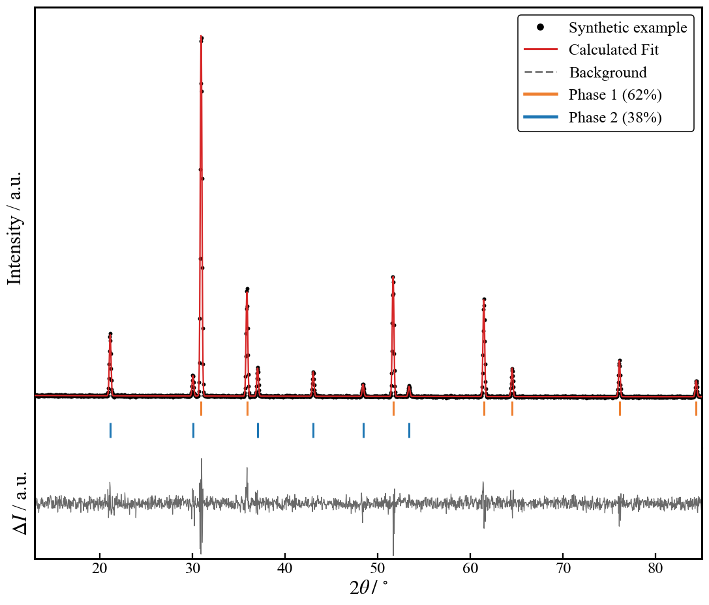

# XRD Rietveld Plot Generator

[](https://github.com/cristian-galeazzi/XRD-Plotter/actions/workflows/tests.yml)
[](LICENSE)
[](https://www.python.org/downloads/)

Give this notebook the CSV your Rietveld refinement exported. It returns the
figure you would put in a paper: measured pattern, refined fit and background
in the upper panel, reflection positions underneath, residuals below, written
out as a 600 dpi image and a vector PDF. You drop your files in a folder and
press run. One run processes the whole folder.

| `USE_SQRT = True`, `WEIGHTED_RESIDUALS = True` | `USE_SQRT = False`, `WEIGHTED_RESIDUALS = False` |
|---|---|
|  |  |

Same pattern, the two settings that change what you see. The square root
keeps the weak reflections visible and `diff/sigma` holds the residuals in a
band a few units wide. The linear axis and the raw difference show the
intensity as it is, with the strongest reflection dominating both panels.

Both figures come from an invented pattern with two phases named `Phase 1`
and `Phase 2`, drawn by [`docs/make_examples.py`](docs/make_examples.py), so
they show the layout and no measurement. Your own phase names replace them.

## Quick start

You need no terminal. With Python and a notebook editor already set up, start
at step 3.

1. **Install Python** (3.10 or newer). On Windows, take the installer from
   [python.org](https://www.python.org/downloads/) and tick **Add python.exe
   to PATH** on the first screen. macOS and Linux usually ship a suitable
   Python already.

2. **Install a notebook editor.** [VS Code](https://code.visualstudio.com/)
   is free and works the same on Windows, macOS and Linux. It offers to
   install its Python and Jupyter extensions the first time you open a
   notebook.

3. **Download this repository.** Use the green *Code* button above, then
   *Download ZIP*, then unzip it somewhere you find again.

4. **Fix the header of each export once.** GSAS-II writes one header name too
   many, so the names sit one column left of their data. Delete the `used`
   cell of the header row in a spreadsheet and shift that row one place left.
   Details in [the input format reference](docs/input-format.md).

5. **Open `XRD_Rietveld_Plotter.ipynb`** in VS Code, put your corrected `.csv`
   files in the `data/` folder beside it, and press *Run All*.

6. *(Optional)* **Put `Samples_metadata.csv` beside the notebook**, not in
   `data/`, to print real sample names, phase fractions and phase colours in
   the legends. See [the metadata reference](docs/metadata.md).

You end up with this. You add files to `data/` only:

```
XRD_Rietveld_Plotter.ipynb   <- the four sections you run
xrd_plotter.py               <- the engine, imported by the notebook
test_xrd_plotter.py          <- the validation suite
Samples_metadata.csv         <- optional, yours, never committed
data/                        <- your CSV exports go here
output/                      <- created on the first run, the figures land here
```

The first cell installs numpy, pandas, matplotlib, ipywidgets, IPython and
pytest when they are missing, so you install nothing by hand. From a
terminal, `pip install -r requirements.txt` does the same in one step. Tested
on Python 3.13 and 3.14 with numpy 2.5, pandas 3.0, matplotlib 3.11,
ipywidgets 8.1, IPython 9.15 and pytest 9.1.

> [!TIP]
> In VS Code, *Select Kernel* at the top right chooses which Python runs the
> notebook. A package looks missing right after you installed it? The
> notebook is almost always running on a different Python from the one you
> installed into. Pick the other kernel and run again.

## What you get

Two files per input file, both from the same drawing, sorted by extension
under `output/`:

| File | Purpose |
|------|---------|
| `output/pdf/<name>_XRD_analysis_sqrt.pdf` | Vector, for the manuscript and for editing in Illustrator or Inkscape |
| `output/png/<name>_XRD_analysis_sqrt.png` | 600 dpi raster, for slides and for a quick look |

The suffix becomes `_linear` with `USE_SQRT = False`, and gains `_counts`
with `WEIGHTED_RESIDUALS = False`, so the variants never overwrite one
another.

The figure, from the top down: the observed pattern as black points, the
refined pattern as a red line, the refined background as a grey dashed line,
one row of coloured ticks per phase at its reflection positions, and a lower
panel with the residuals. The legend names the sample and the phase fractions.

Neither y axis carries numbers nor tick marks. Intensity in a diffractogram is
an arbitrary unit, and an axis of tick labels invites the reader to compare
heights across measurements where no comparison holds. The residual panel
follows the same rule, and carries no line at zero either, so it shows the
shape of the misfit rather than its size. The 2θ axis keeps its numbers, drawn
once under the lower panel. Axis labels read as `quantity / unit`, the IUPAC
form, so no parentheses appear around `a.u.` or `°`.

## Settings

The engine lives in [`xrd_plotter.py`](xrd_plotter.py) and the notebook
imports it as `xp`. Override a constant on the module, so every routine sees
it:

```python
xp.PLOT_X_MIN, xp.PLOT_X_MAX = 13, 85     # fix the 2theta window
xp.WEIGHTED_RESIDUALS = False             # raw diff in the lower panel
xp.PHASE_COLORS = {"phase 1": "#1f77b4"}  # pin a colour to a phase name
```

| Setting | Default | Effect |
|---|---|---|
| `PLOT_X_MIN`, `PLOT_X_MAX` | `None` | The 2θ window. `None` draws the measured range of each file. `x_min` and `x_max` in the metadata win over these, per sample |
| `WEIGHTED_RESIDUALS` | `True` | `diff/sigma` in the lower panel, or the raw `diff` in counts when `False`. The axis label follows |
| `USE_SQRT` | `True` | Set in section 3 of the notebook, not on the module. √I on the drawn copy alone, so weak reflections stay visible beside a strong one. Nothing is written back and the residual panel is untouched |
| `PHASE_COLORS`, `PHASE_LABELS` | empty | Colour and legend name per phase. The metadata file does the same, privately |

The batch prints one block per file: the file name, the phases with their
colours, the 2θ window and where it came from, the figure, then the two files
it wrote. A file it fails to draw prints its reason and the run continues, and
every failure is repeated in the summary at the end. Section 4 redraws one
file in place on every change and prints the metadata row for the window on
screen. Its Save to output button writes that window to `output/` under the
name the batch uses. Every other control there previews only.

## What it accepts

The CSV that the GSAS-II publication-plot dialog saves, not the one from
*Export → Powder data as*.

> [!WARNING]
> That export needs one edit before its first run. GSAS-II writes one header
> name more than it writes data fields, so every name sits one column left of
> its own data: the angles arrive under `used` and the counts arrive under
> `x, 2theta (deg)`. Open the file in a spreadsheet, delete the `used` cell
> of the header row and shift that row one place left. The notebook refuses a
> file still shifted rather than drawing it, since the figure would look
> convincing and be wrong.

After that edit the 2θ column and a residual column are required, `obs`,
`calc` and `bkg` are filled with zeros when absent, and every other column
that holds only a handful of values is read as the reflection positions of a
phase. Phase fractions are in no export: you type them into the metadata
file.

Leave the header names GSAS-II wrote and rename the phase columns only. The
pattern columns are found by their names, so `obs` under another name is
drawn flat and a renamed residual column stops the file. A phase column is
the opposite: whatever you call it is what the legend prints, so `Phase 1`
becomes `Rutile` by editing that header alone.

Both field separators, both decimal marks, UTF-8 and Latin-1, and rows longer
than the header are handled. A file that cannot be drawn is reported with its
reason while the rest of the batch runs.

Full contract, and the header fix in detail:
[docs/input-format.md](docs/input-format.md).

## Limitations

- **An unknown sparse column is read as a phase.** Detection works by
  elimination, so an extra column holding a handful of values gets its own
  tick row. Add its header to `NON_PHASE_COLUMNS` to ignore it.
- **Tick colours follow the legend order unless you pin them.** A sample
  missing one phase paints the remaining one with the colour above it. Pin
  them in the metadata, or in `PHASE_COLORS`, to keep a series comparable.
- **A fixed 2θ window hides data without saying so.** The intensity axis
  rescales to what is left, so two figures cropped differently are no longer
  comparable by height.
- **It draws what the export contains and cannot judge it.** A refinement
  converged on the wrong structure still produces a clean-looking figure.

## Validation

Parsing is bit-exact: every numeric column is read as text and converted with
Python's `float()` rather than the pandas C parser, which is not correctly
rounded. [`test_xrd_plotter.py`](test_xrd_plotter.py) asserts that with
`array_equal`, at zero tolerance, on synthetic exports it builds itself, and
covers the header-alignment guard, the phase rules, the metadata binding, the
window, the axis labels and ticks, the residual choice and the batch. Run it
with `pytest -q`, or run the notebook, which calls it. CI does both on every
push.

Details: [docs/validation.md](docs/validation.md).

## Privacy

No experimental data is in this repository and none must ever be committed.
`data/`, `output/` and `Samples_metadata.csv` are excluded by
[`.gitignore`](.gitignore), notebook outputs are stripped before every
commit, and your phase names belong in the metadata file rather than in the
notebook.

Procedure: [docs/privacy.md](docs/privacy.md).

## How to cite

See [`CITATION.cff`](CITATION.cff). GitHub shows a "Cite this repository"
button. For a permanent, versioned DOI, archive a tagged release on
[Zenodo](https://zenodo.org).

For a refinement done in GSAS-II, whose export format this notebook targets,
please also cite:

> B. H. Toby, R. B. Von Dreele, "GSAS-II: the genesis of a modern
> open-source all purpose crystallography software package",
> *J. Appl. Cryst.* **46**, 544-549 (2013),
> doi:[10.1107/S0021889813003531](https://doi.org/10.1107/S0021889813003531)

Please also cite the libraries behind this notebook:

- J. D. Hunter, "Matplotlib: A 2D Graphics Environment",
  *Comput. Sci. Eng.* **9**, 90-95 (2007),
  doi:[10.1109/MCSE.2007.55](https://doi.org/10.1109/MCSE.2007.55)
- The pandas development team, *pandas-dev/pandas: Pandas*, Zenodo,
  doi:[10.5281/zenodo.3509134](https://doi.org/10.5281/zenodo.3509134)
- C. R. Harris *et al.*, "Array programming with NumPy", *Nature* **585**,
  357-362 (2020),
  doi:[10.1038/s41586-020-2649-2](https://doi.org/10.1038/s41586-020-2649-2)

## AI assistance

This software was developed with the assistance of Claude (Anthropic): the
initial version with Claude Fable, later revisions with Claude Opus. The
author supervised and reviewed every change and remains solely responsible
for the method, the self-check and any result published with this software.

## License

MIT, see [`LICENSE`](LICENSE).
